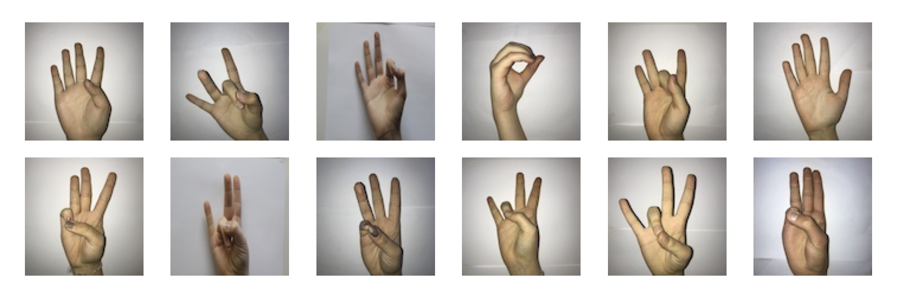

# Sign Language Digit Classification


## Table of Contents

- [Overview](#overview)
- [Installation](#installation)
- [Usage](#usage)
- [Contributing](#contributing)
- [License](#license)

## Overview

This project is a recreation of an existing sign language digit classification system, with the goal of learning and experimenting with different machine learning models and tools. The project uses various models, including linear regression, SVM, decision trees, passive aggressive classifiers, SGD classifier, KNN, perceptron, and ensemble methods such as ada boost classifier, random forest, and gradient boosting classifier. Different hyperparameters combinations for these models where also tried.And methods like random search cv or grid search cv  to find the best hyperparameters in some models. Additionally, different neural network architectures such as LeNet, Vgg16, and MobileNet are explored.

The project uses a dataset of sign language digit images and preprocesses them using tools such as Skimage, Seaborn, and Matplotlib. The preprocessed data is then used to train and evaluate the various models. The performance of each model is evaluated on a test set, and the best-performing model is selected for deployment.

The project also involves deploying the selected model using OpenCV model. Various tools and libraries such as TensorFlow, Keras, scikit-learn, and OpenCV are used throughout the project.

This project was created to learn and experiment with different machine learning models and tools, as well as to gain experience in develoying machine learning models. We hope that this project will be useful for anyone interested in sign language digit classification or machine learning in general.

### Dataset Details
- Image Size : 100 x 100 pixels
- Color Space : RGB
- Number of classes : 10 (0-10 Digits)

## Installation

1. Clone the repository:

   ```git clone https://github.com/tajammulbasheer/sign-language-digit-classification.git```
   
2. Navigate to the project directory:

   ```cd sign-language-digit-classification```
   
3. Create a new virtual environment:
   
   ```python -m venv env```
  
4. Activate the virtual environment:
   - On Windows:
   
     ```env\Scripts\activate```
     
   - On Linux or macOS:
    
     ```source env/bin/activate```

5. Install the required libraries:
   
   ```pip install -r requirements.txt```
   
   This will install the following libraries:
   
   - TensorFlow
   - Keras
   - scikit-learn
   - NumPy
   - Pandas
   - Matplotlib
   - Seaborn
   - OpenCV
   
6. Download the dataset:

   Download the sign language digits dataset from [here](https://example.com/sign_language_digits_dataset.zip) and extract it to the `dataset` directory.

   The dataset should be organized as follows in side the main directory:
   
   ````
   dataset/
   ├── 0/
   │   ├── 0.jpg
   │   ├── 1.jpg
   │   ├── ...
   ├── 1/
   │   ├── 0.jpg
   │   ├── 1.jpg
   │   ├── ...
   ├── ...
   ├── 9/
   │   ├── 0.jpg
   │   ├── 1.jpg
   │   ├── ...
   ```

   
7. Run the Jupyter notebooks:

   ```jupyter notebook```

   This will open a new browser window with the list of Jupyter notebooks in the project. You can then open and run the notebooks to train and evaluate the different machine learning models and explore the dataset.

   Note that some of the notebooks may take a long time to run, especially those that involve training deep learning models. You may want to use a GPU for faster training, or use pre-trained models instead.

## Usage

This project is intended for educational purposes and provides a hands-on experience for exploring different machine learning models and neural network architectures for sign language digit classification. To use the project, follow these steps:

1. Clone the repository:
   
   ```git clone https://github.com/tajammulbasheer/sign-language-digit-classification.git```
   
2. Navigate to the project directory:

   ```cd sign-language-digit-classification```
   
3. Install the required libraries:

   ```pip install -r requirements.txt```
   
4. Explore the project notebooks:

   The project includes several Jupyter notebooks that demonstrate different machine learning models and neural network architectures for sign language digit classification. To run the notebooks, use the following command:
   
   ```jupyter notebook```
5. Train and test models:

   The above mentioned notebooks can also be used to train and test models. Further you can use python scripts in the project to train and test specifically the mobileNet model.
   
   For preprocessing data and arranging into train, test and dev sets run the below script 

   ```python data_preperation.py```

   Also, run the below script for necessary utilities

   ```python utils.py```
   
   To training  and testing  model, run the following command:

   ```python mobile_net.py  ```
   
   To make predictions by using trained model, run the following command:

   ```python mobile_predict.py  ```
   
We hope that this project will be helpful for anyone who wants to learn about different machine learning models and neural network architectures for sign language digit classification. If you have any questions or feedback, please feel free to contact us.

## Contributing
We welcome contributions to this project! If you would like to contribute, please follow these guidelines:

1. Fork the repository and clone it to your local machine.
2. Create a new branch for your contribution:
   
   ```git checkout -b my-contribution```
   
3. Make your changes and commit them with a clear message explaining the changes.
4. Push your changes to your forked repository:
   
   ```git push origin my-contribution```
   
5. Create a pull request from your forked repository to the original repository.
6. Wait for a review of your pull request and make any requested changes.
We encourage contributions in the form of bug reports, feature requests, documentation improvements, and code contributions. If you have any questions or need help getting started, please feel free to contact us.

Please note that this project is released with a Contributor Code of Conduct. By participating in this project you agree to abide by its terms.

## License
This project is licensed under the MIT License.

## Acknowledgments

I would like to thank the creators of the sign language digits dataset for making it available for research and educational purposes. We would also like to thank the developers of TensorFlow, Keras, scikit-learn, NumPy, Pandas, Matplotlib, Seaborn, and OpenCV for their contributions to open-source software, which made this project possible.

Mavi, A., (2020), “A New Dataset and Proposed Convolutional Neural Network Architecture for Classification of American Sign Language Digits”, arXiv:2011.08927 [cs.CV]

## Contact

If you have any questions or feedback, please feel free to contact me at [email](tajammulbasheer999@gmail.com). We would be happy to hear from you.
